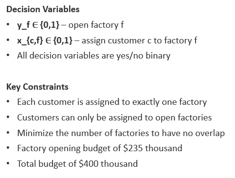
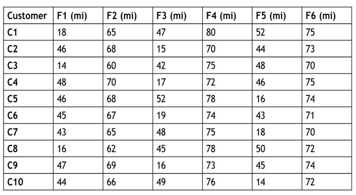
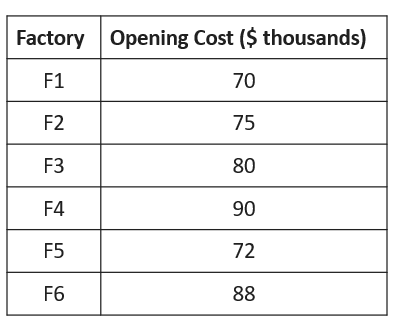
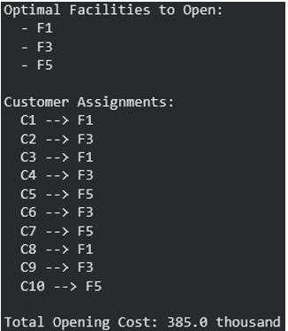
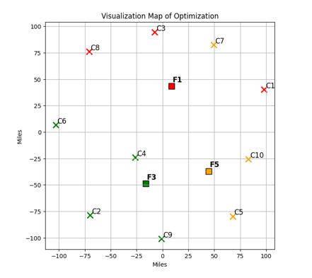

[**Home**](https://am-msba.github.io/Portfolio/) | [**Machine Learning Prediction Model**](https://am-msba.github.io/Machine_Learning_Prediction_Project/) |

### Background

This project addresses the Facility Location Problem (FLP), a strategic decision-making challenge in supply chain management. The goal was to determine the optimal location for factories to minimize the total cost of facility setup and transportation while satisfying all customer demands.

  
   
  <i>Figure 1: Model components and requirements.</i>

---

### Methods and Tools

I developed a custom optimization solver in Python using a Mixed-Integer Programming (MIP) framework and applied it to an internally generated data set. The optimizer uses opening costs and customer distances to evaluate what factory locations should be opened as well as what customers should be designated to the open factories. The decision variables and constraints for the model are shown below:

  
   
  <i>Figure 2: Sample distance matrix.</i>

  
   
  <i>Figure 3: Factory Opening Costs.</i>

---

### Findings
The best solution for the problem is shown below:

  
   
  <i>Figure 4: Optimization Solution.</i>

  
   
  <i>Figure 5: Solution Map Visualization.</i>

